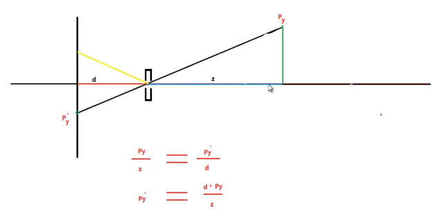
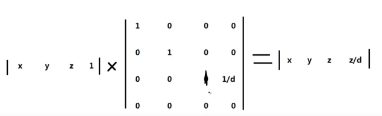

## 1. 小孔成像

> 其实`透视投影`就相当于`小孔成像`

如上图： 3D空间中有一个`P`点，通过`摄像机`投影到屏幕上的 `p'`点。此时投影后的三角形和投影前的三角形 是相似三角形。
之间的角度相同。

所以：
1. `tan(投影前夹角) == tan(投影后夹角)`
> 此时因为小孔成像为倒影 所以将其转换为上边黄红色三角形 y值也不是负数

2. `= p/z == p'/d`
3. `p' = (d * p)/z `

结果：`投影后点p = （投影前点p * 投影后深度） / 投影前深度`

## 2. 投影矩阵

## 透视除法
* 首先上边的`投影矩阵`的结果 其实我们最后到屏幕上（2D）只会有`x,y` 我们会舍弃`z`。
* 但是 问题来了 投影矩阵 是会近大远小的。
* 所以我们使用x,y去除以第四份量(z/d)
这个除法就是`透视除法`

> 从`1的公式` 看起来是 乘法 用(x,y)*d/z ,但此时为何是除法？我的想法是 因为`2的投影矩阵` 矩阵都是相乘的 所以只能使用 1/d这样一个份量。然后在结果的时候 用除法来达到`1的公式`结果